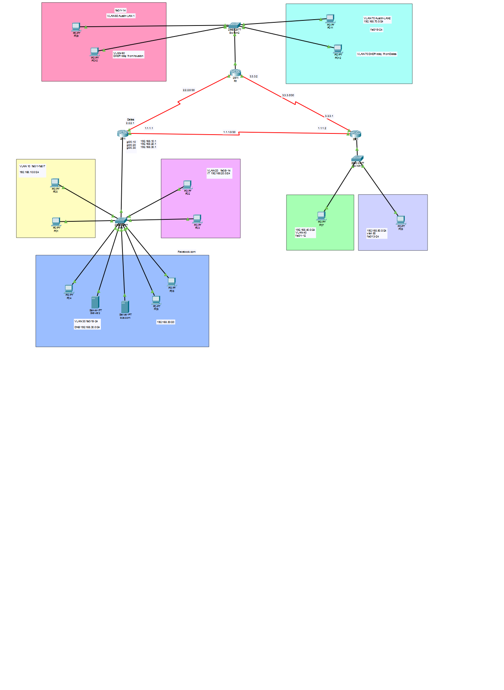

Overview
This project simulates a multi-site enterprise network in Cisco Packet Tracer, connecting three router sites (Dallas, R1, and a third branch) over OSPF, with VLAN segmentation, centralized DHCP with relay, SSH remote management, and ACL-based access control.

Key features demonstrated:

OSPF Routing — dynamic routing between three routers over point-to-point links
VLAN Segmentation — multiple VLANs per site for department/traffic separation
Trunking — trunk links carrying multiple VLANs between switches and routers (router-on-a-stick)
DHCP & DHCP Relay — centralized DHCP service with relay agents forwarding requests from remote VLANs to a central DHCP server
SSH — secure remote management access to network devices
ACL — access control lists restricting traffic between VLANs/subnets
Network Topology
Show Image

The network consists of three router sites interconnected over OSPF:

Dallas (Router 1)

Subinterfaces: Gi0/0.10, Gi0/0.20, Gi0/0.30 (router-on-a-stick for VLANs 10/20/30)
VLAN 10 — 192.168.10.0/24
VLAN 20 (IT) — 192.168.20.0/24
VLAN 30 (DNS) — 192.168.30.0/24, hosts DNS server and a second server
WAN links: 2.2.2.1 (to R1) and 1.1.1.1 (to third router)
R1

Connects to a switch serving two VLANs:
VLAN 60 — Austin LAN 1
VLAN 70 — Austin LAN 2, 192.168.70.0/24, DHCP relay pointing to Dallas
WAN links: 3.3.3.2 (to third router) and 2.2.2.2 (to Dallas)
Third Router (right side)

Connects to a switch serving two VLANs:
VLAN 40 — 192.168.40.0/24
VLAN 50 — 192.168.50.0/24
WAN links: 3.3.3.1 (to R1) and 1.1.1.2 (to Dallas)
Key Configurations
VLAN & Trunk Setup
[Paste your VLAN creation and trunk port configuration here]
Router-on-a-Stick (Subinterfaces)
[Paste your subinterface configuration for VLANs 10/20/30 here]
OSPF Configuration
[Paste your OSPF area/network commands here]
DHCP & DHCP Relay
[Paste your DHCP pool configuration and ip helper-address (relay) commands here]
SSH Configuration
[Paste your SSH/VTY line configuration here]
ACL Configuration
[Paste your access-list rules here]
Verification
Add screenshots or command output showing:

show ip route — OSPF routes learned
show ip ospf neighbor — OSPF adjacencies
show vlan brief — VLAN assignments
DHCP relay — a PC in VLAN 70 obtaining an IP from the Dallas DHCP server
SSH login to a router from a client
ACL test — traffic permitted/denied as expected
Tools Used
Cisco Packet Tracer [version number]
Project File
The complete .pkt file is available in this repository under ospf-dhcp-acl-ssh-project/.

